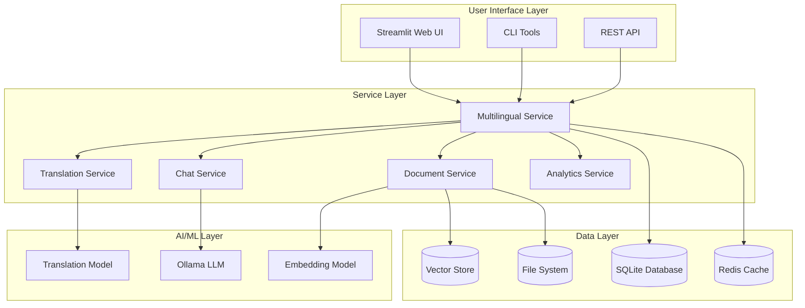
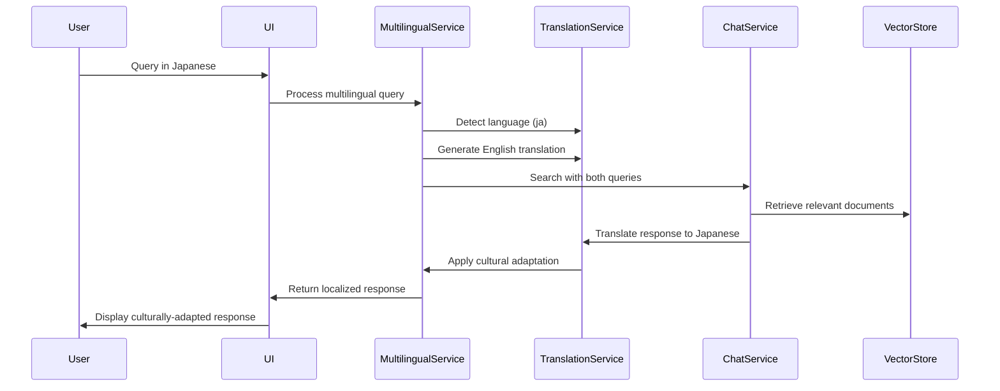
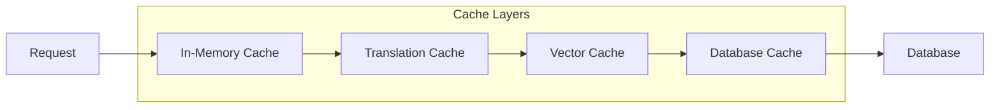

# Kurachi AI - System Architecture

## 🏗️ High-Level Architecture



## 🔧 Core Components

### 1. Multilingual Conversation Interface
- **Purpose**: Manages language preferences and cross-language interactions
- **Key Features**:
  - User language preference management
  - Cross-language query processing
  - Cultural adaptation for Japanese business contexts
  - Real-time language detection

### 2. Intelligent Translation Service
- **Purpose**: Provides context-aware translation with business glossaries
- **Key Features**:
  - Business terminology preservation
  - Quality assessment and caching
  - Cultural adaptation (keigo, formality levels)
  - Back-translation validation

### 3. Document Processing Pipeline
- **Purpose**: Ingests and processes multilingual documents
- **Key Features**:
  - Language detection and classification
  - Intelligent chunking strategies
  - Vector embedding generation
  - Metadata extraction and enrichment

### 4. Chat Service with RAG
- **Purpose**: Provides conversational AI with document retrieval
- **Key Features**:
  - Retrieval-Augmented Generation (RAG)
  - Conversation memory management
  - Source attribution and citations
  - Streaming responses

## 🌐 Multilingual Architecture

### Language Processing Flow



### Language Support Matrix

| Language | UI Support | Translation | Cultural Adaptation | Business Glossary |
|----------|------------|-------------|-------------------|------------------|
| English  | ✅ Full    | ✅ Full     | ✅ Basic          | ✅ 89 terms      |
| Japanese | ✅ Full    | ✅ Full     | ✅ Advanced       | ✅ 165 terms     |
| Chinese  | 🔄 Planned | 🔄 Planned  | 🔄 Planned        | 🔄 Planned       |

## 📊 Data Architecture

### Database Schema

```sql
-- User preferences with multilingual support
CREATE TABLE user_preferences (
    user_id TEXT NOT NULL,
    preference_type TEXT NOT NULL,
    preferences TEXT NOT NULL,  -- JSON with enum normalization
    created_at TEXT NOT NULL,
    updated_at TEXT NOT NULL,
    UNIQUE(user_id, preference_type)
);

-- Persistent metrics for monitoring
CREATE TABLE metrics (
    key TEXT PRIMARY KEY,
    value INTEGER NOT NULL DEFAULT 0,
    updated_at TEXT NOT NULL DEFAULT CURRENT_TIMESTAMP
);

-- Chat conversations with metadata
CREATE TABLE chat_conversations (
    id TEXT PRIMARY KEY,
    user_id TEXT NOT NULL,
    title TEXT NOT NULL,
    created_at TEXT NOT NULL,
    updated_at TEXT NOT NULL,
    metadata TEXT  -- JSON with language preferences
);
```

### Vector Store Organization

```
Vector Store Structure:
├── Documents by Language
│   ├── en/ (English documents)
│   ├── ja/ (Japanese documents)
│   └── mixed/ (Mixed-language documents)
├── Embeddings
│   ├── BGE-M3 (Multilingual embeddings)
│   └── Language-specific embeddings
└── Metadata
    ├── Language detection results
    ├── Cultural context markers
    └── Business domain classifications
```

## 🔒 Security Architecture

### Authentication & Authorization
- Session-based authentication
- User preference isolation
- Audit logging for all operations
- Input validation and sanitization

### Data Protection
- Enum serialization safety
- SQL injection prevention
- XSS protection in UI
- Secure file upload handling

## 📈 Performance Architecture

### Caching Strategy


### Metrics & Monitoring
- Real-time performance metrics
- Cache hit rate monitoring
- Translation quality tracking
- User interaction analytics

## 🚀 Deployment Architecture

### Development Environment
```yaml
services:
  app:
    build: .
    ports: ["8501:8501"]
    environment:
      - OLLAMA_BASE_URL=http://ollama:11434
  
  ollama:
    image: ollama/ollama
    ports: ["11434:11434"]
    volumes: ["ollama_data:/root/.ollama"]
  
  redis:
    image: redis:alpine
    ports: ["6379:6379"]
```

### Production Considerations
- Horizontal scaling with load balancers
- Database replication for high availability
- CDN for static assets
- Monitoring and alerting systems

## 🔄 Integration Points

### External Services
- **Ollama**: Local LLM inference
- **BGE-M3**: Multilingual embeddings
- **Redis**: Caching layer (optional)
- **Neo4j**: Knowledge graph (optional)

### API Interfaces
- REST API for external integrations
- WebSocket for real-time features
- CLI tools for administration
- Webhook support for notifications

## 📋 Quality Assurance

### Testing Strategy
- Unit tests for core components
- Integration tests for service interactions
- End-to-end smoke tests
- Performance benchmarking

### Code Quality
- Type hints throughout codebase
- Comprehensive error handling
- Logging and monitoring
- Documentation standards